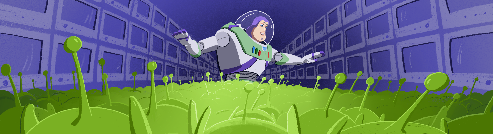

# 3DViewer v1.0

> При старте работы над проектом просим вас постараться хронометрировать время работы над проектом.
> По завершении работы над проектом просим вас ответить на два вопроса [в этом опросе](https://forms.gle/51aADrXJGHYH9jEi6)

Implementation of 3DViewer v1.0.

The russian version of the task can be found in the repository.


## Contents

0. [Preamble](#preamble)
1. [Chapter I](#chapter-i) \
   1.1. [Introduction](#introduction)
2. [Chapter II](#chapter-ii) \
   2.1. [Information](#information)
3. [Chapter III](#chapter-iii) \
   3.1. [Part 1](#part-1-3dviewer) \
   3.2. [Part 2](#part-2-bonus-settings) \
   3.3. [Part 3](#part-3-bonus-record)


## Preamble



Somewhere near the water cooler in '90:

*-- We can't make a cartoon about animals.*

*- Why the hell not? John, your Tin Toy has made a splash! Imagine what will happen when the world sees something like 101 Dalmatians in 3d!*

*-- Well, that’s the problem. There is not yet enough computational power to animate complex objects. The animals would have to wait, because it’s not possible to simulate their fur. Either it will be a cartoon about bald animals. We have to wait a few years for Moore's Law to work its way through.*

*- Well, okay, what about people? Why can’t we make a cartoon about people?*

*-- We can, except it would be a horror movie, because their faces will look the same as yours now, trying to convince me to make a fatal mistake.*

You realised that Lasseter's arguments were too convincing and there was no point in arguing.

*- Fine, let’s say you’re right. But what cartoon should we make?*

*-- It's simple, my friend. It will be a cartoon about toys, like the short one that brought us the Oscar. The natural shape of the toys will fit perfectly with the low-poly 3d models we're able to animate. And these are toys after all, so poor facial expressions won't be critical. And there's already a plot in my mind. Let's bring them to life! The story will be based on the relationship between the toys and the child.*

*- Sounds interesting!*

*-- It is. You should go to your team asap and start developing 3d modelling software. If we want to make this cartoon, we need our own software tools. The ones that on the market will only allow us to animate a wooden pyramid, and even then in the form of a cube.*

*- Okay, but first, we need to do the most important thing - the preview screen.*

*-- Good luck!*

Pixar had over 100 computers to render the 3d scenes. Recognising the potential of such power, you gave an inspirational speech to your team praising 3d visualisation technology and then quickly got to work! This cartoon is destined to make history...


## Chapter I

## Introduction

In this project you will implement a program to view 3D wireframe models (3D Viewer) in the C programming language. The models themselves must be loaded from .obj files and be viewable on the screen with the ability to rotate, scale and translate.


## Chapter II

## Information

A wireframe model is a model of an object in 3D graphics, which is a set of vertices and edges that defines the shape of the displayed polyhedral object in three-dimensional space.

### Structured programming reminder

Structured programming based on two main principles:
- The principle of divide and conquer (decomposition) - the principle of solving complex problems by decomposing them into many smaller subproblems, that are easier to understand and solve. Besides, there is no code duplication when solving subproblems and the solutions themselves are reused if necessary;
- The principle of hierarchical ordering - the principle of organising the components of a problem into hierarchical tree structures with new details added at each level (from the top level with a single entry point, to the lower levels with specific data structures and implementations). That is, there should be no calculations and no input/output operations on the same level.

Thus, using a structured style results in the program being built like a puff pastry pie from top to bottom. Errors are generated at the lower levels and thrown up to the top, where they are displayed to the user.

### .Obj file format for representing the definition of 3D objects

.Obj file is a geometry definition file format first developed by Wavefront Technologies. The file format is open and accepted by many 3D graphics application vendors.

The .obj file format is a simple data format that represents only three-dimensional geometry, specifically the position of each vertex, the UV of each texture coordinate vertex, vertex normals and the faces that define each polygon as a list of vertices and texture vertices. Obj coordinates have no units, but Obj files can contain scale information in a readable comment line.

The example of .obj file format:
```
  # List of geometric vertices, with (x, y, z [,w]) coordinates, w is optional and defaults to 1.0.
  v 0.123 0.234 0.345 1.0
  v ...
  ...
  # Texture coordinates (u, [,v ,w]), w is optional and default to 0.
  vt 0.500 -1.352 [0.234]
  vt ...
  ...
  # Normals (x,y,z)
  vn 0.707 0.000 0.707
  vn ...
  ...
  # Parameter space vertices (u [,v] [,w])
  vn 0.707 0.000 0.707
  vn ...
  ...
  # Polygonal face element
  f v1 v2 v3
  f ...
  ...
  # Group
  g Group1
  ...
  # Object
  o Object1
  ```

In this project, you will only need to implement vertices and surfaces list support. Everything else is optional.

### Affine transformations

This section will describe basic affine transformations (translation, rotation, scaling) in the plane, using two-dimensional objects (images) as an example. Similarly, affine transformations can also be used for three-dimensional space.

An affine transformation is a mapping in a plane or space onto itself in which parallel lines transforms into parallel lines, intersecting lines into intersecting lines, and skew lines into skew lines.
A transformation in a plane is called affine if it is mutually unambiguous and the image of any line is a line. A transformation (mapping) is called mutually unambiguous (bijective) if it converts different points to different ones, and each point is converted to a point.

In algebraic terms, an affine transformation is a transformation of the form _f(x) = M x + v_, where _M_ is some invertible matrix and _v_ is some value.

Properties of affine transformations:
- A composition of affine transformations is an affine transformation too
- The inverse of an affine transformation is an affine transformation too
- The ratio of areas is conserved.
- The ratio of lengths of line segments is conserved.

#### Translation

Translation matrix in uniform two-dimensional coordinates
```
1 0 a
0 1 b
0 0 1
```

where _a_ and _b_ are the values on _x_ and _y_ by which the source point should be moved. Thus, to move a point, you must multiply the translation matrix by it.
```
x1     1 0 a     x 
y1  =  0 1 b    y
1      0 0 1     1
```

where _x_ and _y_ are the original coordinates of the point and _x1_ and _y1_ are the resulting coordinates of the new point after translation.

#### Rotation

Clockwise rotation matrix in uniform two-dimensional coordinates
```
cos(a)  sin(a) 0
-sin(a) cos(a) 0
0       0      1
```

where _a_ is the rotation angle in two-dimensional space. To get the coordinates of the new point it is necessary to multiply the rotation matrix by the original point in the same way as the translation matrix
```
x1     cos(a)  sin(a) 0     x 
y1  =  -sin(a) cos(a) 0    y
1      0       0      1     1
```

#### Scaling

Scaling matrix in uniform two-dimensional coordinates
```
a 0 0
0 b 0
0 0 1
```

where _a_ and _b_ are the scaling factors for the OX and OY axes respectively. Obtaining coordinates of a new point is similar to the cases described above.


## Chapter III

## Part 1. 3DViewer

You need to develop a program to visualise 3D wireframe models:

- The program must be developed in C language of C11 standard using gcc compiler. You can use any additional QT libraries and modules
- The program code must be located in the src folder
- The program must be built with Makefile which contains standard set of targets for GNU-programs: all, install, uninstall, clean, dvi, dist, tests, gcov. Installation directory could be arbitrary, except the building one
- The program must be developed according to the principles of structured programming
- When writing code it is necessary to follow the Google style
- Prepare full coverage of modules related to model loading and affine transformations with unit-tests
- There should be only one model on the screen at a time
- The program must provide the ability to:
    - Load a wireframe model from an obj file (vertices and surfaces list support only).
    - Translate the model by a given distance in relation to the X, Y, Z axes.
    - Rotate the model by a given angle relative to its X, Y, Z axes.
    - Scale the model by a given value.
- GUI implementation, based on any GUI library with API for C89/C99/C11 (GTK+, Nuklear, raygui, microui, libagar, libui, IUP, LCUI, CEF, Qt, etc.)
- The graphical user interface must contain:
    - A button to select the model file and a field to output its name.
    - A visualisation area for the wireframe model.
    - Button/buttons and input fields for translating the model.
    - Button/buttons and input fields for rotating the model.
    - Button/buttons and input fields for scaling the model.
    - Information about the uploaded model - file name, number of vertices and edges.
- The program must correctly processes and allows user to view models with details up to 100, 1000, 10,000, 100,000, 1,000,000  vertices without freezing (a freeze is an interface inactivity of more than 0.5 seconds)

## Part 2. Bonus. Settings

- The program must allow customizing the type of projection (parallel and central)
- The program must allow setting up the type (solid, dashed), color and thickness of the edges, display method (none, circle, square), color and size of the vertices
- The program must allow choosing the background color
- Settings must be saved between program restarts

## Part 3. Bonus. Record

- The program must allow saving the captured (rendered) images as bmp and jpeg files.
- The program must allow recording small screencasts by a special button - the current custom affine transformation of the loaded object into gif-animation (640x480, 10fps, 5s)

